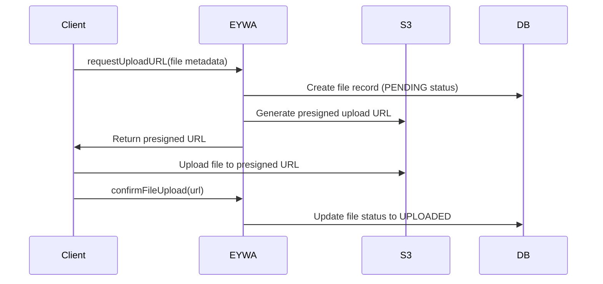
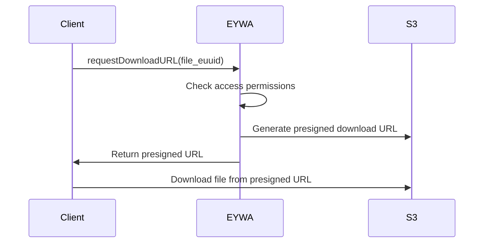

# EYWA File Storage System

EYWA provides a comprehensive file storage system that combines S3-compatible storage with a sophisticated access control and folder hierarchy system. The system supports secure file uploads, downloads, and management with role-based permissions and inheritance.

## Architecture Overview

The file storage system consists of several key components:

1. **Storage Backend** - S3-compatible storage (AWS S3 or MinIO)
2. **Database Layer** - PostgreSQL for metadata and access control
3. **Access Control** - Role-based permissions with inheritance
4. **GraphQL API** - Complete CRUD operations and custom endpoints
5. **File Service** - Presigned URL generation and lifecycle management

## Storage Backend Configuration

### Environment Variables

The file storage system is configured through environment variables:

```bash
# S3-Compatible Storage Configuration
EYWA_STORAGE_ENDPOINT="http://localhost:9000"        # MinIO/S3 endpoint
EYWA_STORAGE_ACCESS_KEY="minioadmin"                 # Access key
EYWA_STORAGE_SECRET_KEY="minioadmin"                 # Secret key  
EYWA_STORAGE_REGION="us-east-1"                      # AWS region
EYWA_STORAGE_BUCKET="eywa-files"                     # Bucket name
EYWA_STORAGE_EXPIRY_MINUTES="15"                     # URL expiry time
```

### Local Development with MinIO

For local development, you can run MinIO using Docker:

```bash
docker run -p 9000:9000 -p 9001:9001 \
  -e "MINIO_ROOT_USER=minioadmin" \
  -e "MINIO_ROOT_PASSWORD=minioadmin" \
  minio/minio server /data --console-address ":9001"
```

Access the MinIO console at `http://localhost:9001`

### Production with AWS S3

For production deployments with AWS S3:

```bash
EYWA_STORAGE_ENDPOINT="https://s3.amazonaws.com"
EYWA_STORAGE_ACCESS_KEY="your-aws-access-key"
EYWA_STORAGE_SECRET_KEY="your-aws-secret-key"
EYWA_STORAGE_REGION="us-west-2"
EYWA_STORAGE_BUCKET="your-production-bucket"
```

## Data Model

### File Entity

Files are stored with the following structure:

```clojure
{:euuid #uuid "..."              ; Unique file identifier
 :name "document.pdf"            ; Original filename
 :content_type "application/pdf" ; MIME type
 :size 1024000                   ; File size in bytes
 :status :UPLOADED               ; Upload status (:PENDING, :UPLOADED)
 :folder {:euuid #uuid "..."}    ; Parent folder reference
 :uploaded_by #uuid "..."        ; User who uploaded the file
 :modified_by #uuid "..."        ; Last modifier
 :created_at #inst "..."         ; Creation timestamp
 :modified_at #inst "..."}       ; Last modification timestamp
```

### Folder Entity

Folders organize files in a hierarchical structure:

```clojure
{:euuid #uuid "..."              ; Unique folder identifier
 :name "Documents"               ; Folder name
 :path "/Projects/Documents/"    ; Full path (computed automatically)
 :parent {:euuid #uuid "..."}    ; Parent folder reference
 :created_by #uuid "..."         ; Creator
 :modified_by #uuid "..."        ; Last modifier
 :read_users [...]               ; Users with read access
 :write_users [...]              ; Users with write access
 :delete_users [...]             ; Users with delete access
 :read_groups [...]              ; Groups with read access
 :write_groups [...]             ; Groups with write access
 :delete_groups [...]}           ; Groups with delete access
```

### Access Relations

The access control system uses separate many-to-many relations:

- **Read Access**: `folder_read_users`, `folder_read_groups`
- **Write Access**: `folder_write_users`, `folder_write_groups`  
- **Delete Access**: `folder_delete_users`, `folder_delete_groups`

## File Lifecycle

### 1. Upload Process



### 2. Download Process



## GraphQL API

### Queries

#### Standard Entity Operations
```graphql
# Get single file
getFile(euuid: UUID!): File

# Search files with filtering, sorting, pagination
searchFile(
  _where: searchFileOperator
  _order_by: orderByFileOperator
  _limit: Int
  _offset: Int
): [File]

# Get single folder
getFolder(euuid: UUID!): Folder

# Search folders
searchFolder(
  _where: searchFolderOperator
  _order_by: orderByFolderOperator
  _limit: Int
  _offset: Int
): [Folder]
```

#### Custom File Service Operations
```graphql
# Generate presigned download URL
requestDownloadURL(file: FileInput): String
```

### Mutations

#### Standard Entity Operations
```graphql
# Create or update file metadata
syncFile(data: FileInput!): File

# Create file metadata (must not exist)
stackFile(data: FileInput!): File

# Update file metadata
sliceFile(euuid: UUID!, data: FileInput!): FileSlice

# Delete file (removes from storage too)
deleteFile(euuid: UUID!): Boolean

# Create or update folder
syncFolder(data: FolderInput!): Folder

# Create folder (must not exist)
stackFolder(data: FolderInput!): Folder

# Delete folder
deleteFolder(euuid: UUID!): Boolean
```

#### Custom File Service Operations
```graphql
# Request presigned upload URL and create file record
requestUploadURL(file: FileInput!): String

# Confirm file upload completion
confirmFileUpload(url: String!): Boolean
```

### Security Features

#### Presigned URLs
- **Time-limited**: URLs expire after configured time (default 15 minutes)
- **UUID-based storage keys**: Files stored using UUIDs, not original names
- **Non-guessable locations**: Cannot enumerate or guess file URLs

#### Access Control Integration
- **User context tracking**: All operations track the authenticated user
- **Permission inheritance**: New folders inherit parent permissions
- **Role-based access**: Read, write, and delete permissions separately managed

## Access Control System

### Permission Types

The file system supports three permission levels:

1. **Read**: View files and folders, generate download URLs
2. **Write**: Create, modify files and folders, upload files
3. **Delete**: Remove files and folders

### Permission Inheritance

When creating new folders, permissions are automatically inherited from the parent folder:

```clojure
;; Parent folder permissions
{:read_groups [{:euuid #uuid "developers-group"}]
 :write_groups [{:euuid #uuid "developers-group"}]
 :delete_groups [{:euuid #uuid "admin-group"}]}

;; Child folder automatically inherits these permissions
{:name "New Subfolder"
 :parent {:euuid parent-folder-euuid}
 ;; Permissions copied automatically:
 :read_groups [{:euuid #uuid "developers-group"}]
 :write_groups [{:euuid #uuid "developers-group"}]  
 :delete_groups [{:euuid #uuid "admin-group"}]}
```

### Access Resolution

The system checks access permissions in this order:

1. **Superuser**: Bypass all checks if user has superuser role
2. **Owner access**: File creators and folder creators have implicit access
3. **User permissions**: Direct user-to-folder permission assignments
4. **Group permissions**: User's groups checked against folder group permissions

### File Access Through Folders

Files inherit access control from their parent folders:

- File read access = Parent folder read access
- File write access = Parent folder write access  
- File delete access = Parent folder delete access

### Root Folder Protection

The root folder (`/`) has special protections:

- Cannot be deleted or renamed
- Permissions cannot be modified
- Path cannot be changed
- Created automatically during system initialization

## Advanced Features

### Folder Hierarchy Management

#### Automatic Path Computation
```clojure
;; When creating a folder, path is computed automatically
{:name "Documents"
 :parent {:euuid parent-folder-euuid}}

;; Results in:
{:name "Documents"
 :path "/Projects/Documents/"  ; Computed from parent path + name
 :parent {:euuid parent-folder-euuid}}
```

#### Path Validation
- Root path is always `/`
- Paths end with `/` for folders
- Special characters not allowed in folder names: `[/\:*?"<>|]`
- Maximum folder name length: 300 characters
- Empty names not allowed (except root)

### File Name Uniqueness

Within each folder, file names must be unique:

```clojure
;; This will throw an error if "report.pdf" already exists in the folder
{:name "report.pdf"
 :folder {:euuid folder-euuid}}
```

### Status Tracking

Files progress through status states:

1. **`:PENDING`**: File record created, awaiting upload
2. **`:UPLOADED`**: File successfully uploaded to storage

### Bulk Operations

#### Bulk Upload URLs
```graphql
# Generate multiple upload URLs at once
requestBulkUploadURLs(files: [FileInput!]!): [UploadResponse]
```

#### Folder-based Operations
```graphql
# Get all files in a folder
searchFolderFile(
  _where: searchFileOperator
  _limit: Int
): [File]

# Folder-specific CRUD operations
syncFolderFile(data: FileInput!): File
stackFolderFile(data: FileInput!): File
deleteFolderFile(euuid: UUID!): Boolean
```

## Error Handling

### Common Error Scenarios

#### Upload Errors
```javascript
// Missing filename
throw new Error("Filename is required")

// Service not initialized  
throw new Error("File service not initialized")

// Folder access denied
throw new Error("Couldn't access parent for folder. Parent either doesn't exist or you dont have write permissions")
```

#### Access Control Errors
```javascript
// Insufficient permissions
throw new Error("You don't have permissions to delete this file!")

// Inactive user
throw new Error("User is not active. Permission denied!")

// Root folder protection
throw new Error("ROOT folder cannot be removed!")
```

#### File Conflicts
```javascript
// Duplicate file name
throw new Error("File /Projects/report.pdf already exists!")

// Missing file in storage
throw new Error("Trying to update files that are not present in DB! First upload them.")
```

### Health Checks

The system provides health checking through the `eywa core doctor` command:

```bash
✅ File Storage: Connected and bucket accessible
❌ File Storage: Configuration incomplete
    *  Missing EYWA_STORAGE_ENDPOINT
    *  Missing EYWA_STORAGE_ACCESS_KEY
⚠️  File Storage: Connected but bucket not found
           Bucket 'eywa-files' does not exist
```

## Best Practices

### Security
1. **Use HTTPS in production**: Set `EYWA_STORAGE_ENDPOINT` to HTTPS endpoint
2. **Rotate access keys regularly**: Update S3/MinIO credentials periodically
3. **Minimize URL expiry time**: Balance security vs usability for presigned URLs
4. **Enable access control**: Set `EYWA_IAM_ENFORCE_ACCESS=true` in production

### Performance
1. **Increase pool size in production**: Set higher `HIKARI_MAX_POOL_SIZE`
2. **Use regional S3 endpoints**: Choose closest region for better performance
3. **Monitor bucket size**: Large buckets may need partitioning strategies
4. **Cache folder structures**: Frequently accessed folder hierarchies

### Organization
1. **Plan folder hierarchy**: Design logical folder structure before deployment
2. **Use descriptive names**: Avoid generic names like "temp" or "misc"
3. **Set up groups early**: Create groups before assigning folder permissions
4. **Document access patterns**: Keep track of who needs access to what

### Maintenance
1. **Monitor storage usage**: Track bucket size and file count
2. **Clean up pending uploads**: Remove orphaned PENDING files periodically
3. **Audit permissions**: Regularly review and update folder access rights
4. **Backup metadata**: File metadata in PostgreSQL should be backed up

## Troubleshooting

### Common Issues

#### Upload URL Generation Fails
1. Check environment variables are set correctly
2. Verify MinIO/S3 service is running and accessible
3. Check bucket exists and has proper permissions
4. Verify access key/secret key are correct

#### Permission Denied Errors  
1. Check user is active: `searchUser(_where: {euuid: {_eq: "user-id"}}) { active }`
2. Verify user has required group memberships
3. Check folder permissions: `getFolder(euuid: "folder-id") { read_groups { name } }`
4. Ensure `EYWA_IAM_ENFORCE_ACCESS=true` if using access control

#### File Upload Confirmation Fails
1. Check upload URL hasn't expired (default 15 minutes)
2. Verify file was actually uploaded to S3/MinIO
3. Check URL cache hasn't been cleared
4. Ensure confirmFileUpload is called with exact URL returned

#### Folder Creation Issues
1. Verify parent folder exists and user has write access
2. Check folder name doesn't contain invalid characters
3. Ensure folder name is unique within parent
4. Verify user account is active

This comprehensive file storage system provides enterprise-grade file management with security, scalability, and ease of use.